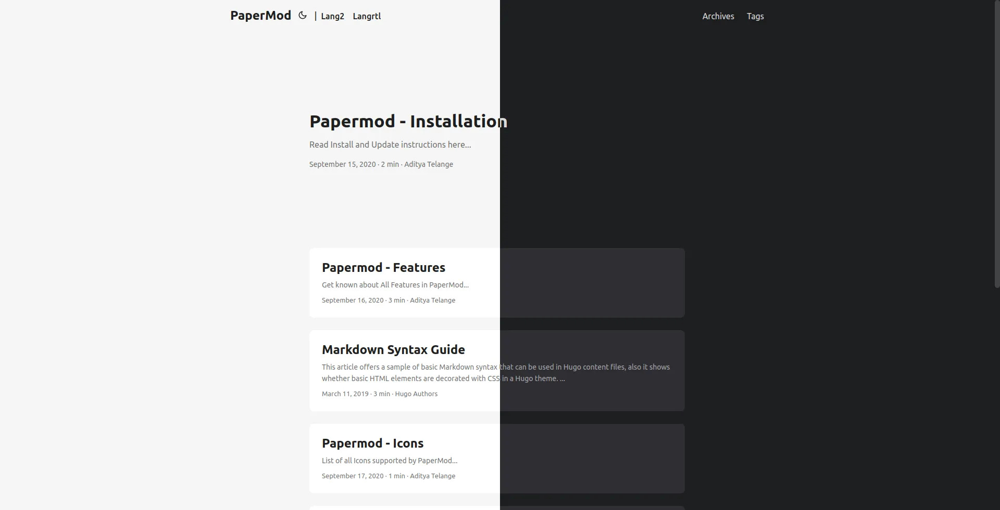
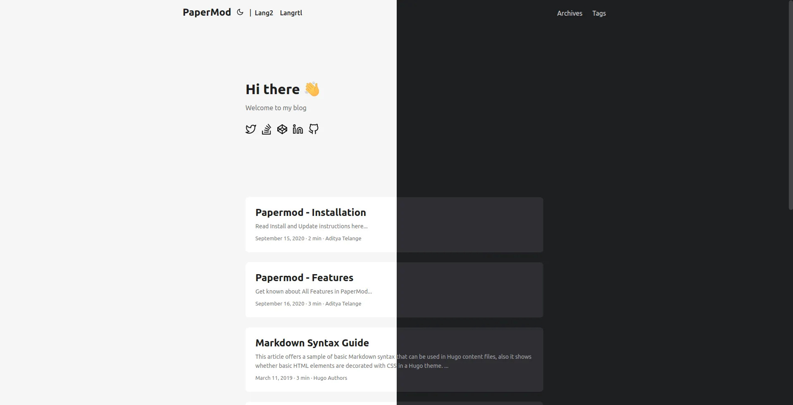

### Intro

-   **We'll be using `yml/yaml` format for all examples down below, I recommend using `yml` over `toml` as it is easier to read.**

-   You can find any [YML to TOML](https://www.google.com/search?q=yml+to+toml) converters if necessary.

---

### Assets (js/css)

The following is enabled by default

-   [minification](https://gohugo.io/hugo-pipes/minification/) - makes the assets size smallest as possible.
-   [bundling](https://gohugo.io/hugo-pipes/bundling/) - bundles all the styles in one single asset
-   [fingerprint/integrity](https://gohugo.io/hugo-pipes/fingerprint/) check.

---

### Default Theme light/dark/auto

```yml
params:
    # defaultTheme: light
    # defaultTheme: dark
    defaultTheme: auto # to switch between dark or light according to browser theme
```

</details>

---

### Theme Switch Toggle (enabled by default)

Shows icon besides title of page to change theme

To disable it :

```yml
disableThemeToggle: true
```

You can refer following table for better understanding...

| `defaultTheme` | `disableThemeToggle` | checks local storage? | checks system theme? | Info              |
| -------------- | -------------------- | --------------------- | -------------------- | ----------------- |
| `auto`         | true                 | No                    | Yes                  | only system theme |
|                | false                | Yes (if not->2)       | Yes (2)              | _switch present_  |
| `dark`         | true                 | No                    | No                   | force dark only   |
|                | false                | Yes                   | No                   | _switch present_  |
| `light`        | true                 | No                    | No                   | force light only  |
|                | false                | Yes                   | No                   | _switch present_  |

---

### Archives Layout

Create a page with `archive.md` in `content` directory with following content

```shell
.
├── config.yml
├── content/
│   ├── archives.md   <--- Create archive.md here
│   └── posts/
├── static/
└── themes/
    └── PaperMod/
```

and add the following to it

```yml
---
title: "Archive"
layout: "archives"
url: "/archives/"
summary: archives
---

```

**Note:** Archives Layout does not support Multilingual Month Translations.

ex: [archives.md](https://raw.githubusercontent.com/adityatelange/hugo-PaperMod/exampleSite/content/archives.md)

---

### Regular Mode (default-mode)



---

### Home-Info Mode



Use 1st entry as some Information

add following to config file

```yml
params:
    homeInfoParams:
        Title: Hi there wave
        Content: Can be Info, links, about...

    socialIcons: # optional
        - name: "<platform>"
            url: "<link>"
        - name: "<platform 2>"
            url: "<link2>"
```

ex. [config.yml#L106](https://github.com/adityatelange/hugo-PaperMod/blob/exampleSite/config.yml#L106)

---

### Profile Mode


Shows Index/Home page as Full Page with Social Links and Image

add following to config file

```yml
params:
    profileMode:
        enabled: true
        title: "<Title>" # optional default will be site title
        subtitle: "This is subtitle"
        imageUrl: "<image link>" # optional
        imageTitle: "<title of image as alt>" # optional
        imageWidth: 120 # custom size
        imageHeight: 120 # custom size
        buttons:
            - name: Archive
                url: "/archive"
            - name: Github
                url: "https://github.com/"

    socialIcons: # optional
        - name: "<platform>"
            url: "<link>"
        - name: "<platform 2>"
            url: "<link2>"
```

---

### Search Page

PaperMod uses [Fuse.js Basic](https://fusejs.io/getting-started/different-builds.html#explanation-of-different-builds) for seach functionality

Add the following to site config, `config.yml`

```yml
outputs:
    home:
        - HTML
        - RSS
        - JSON # is necessary
```

Create a page with `search.md` in `content` directory with following content

```yml
---
title: "Search" # in any language you want
layout: "search" # is necessary
# url: "/archive"
# description: "Description for Search"
summary: "search"
---

```

To hide a particular page from being searched, add it in post's fron't matter

```yml
---
searchHidden: true
```

ex: [search.md](https://raw.githubusercontent.com/adityatelange/hugo-PaperMod/exampleSite/content/search.md)

> Search Page also has Key bindings:
>
> -   Arrow keys to move up/down the list
> -   Enter key (return) or Right Arrow key to Go to highlighted page
> -   Escape key to clear searchbox and results

For Multilingual use `search.<lang>.md` ex. `search.es.md`.

**Note:** Search will work only on current language, user is currently on !

**Customizing Fusejs Options**

Refer https://fusejs.io/api/options.html for Options, Add those as shown below.

```yml
params:
    fuseOpts:
        isCaseSensitive: false
        shouldSort: true
        location: 0
        distance: 1000
        threshold: 0.4
        minMatchCharLength: 0
        keys: ["title", "permalink", "summary", "content"]
```

---

### Draft Page indication

adds `[draft]` mark to indicate draft pages.

---

### Post Cover Image

In post's page-variables add :

```yml
cover:
    image: "<image path/url>"
    # can also paste direct link from external site
    # ex. https://i.ibb.co/K0HVPBd/paper-mod-profilemode.png
    alt: "<alt text>"
    caption: "<text>"
    relative: false # To use relative path for cover image, used in hugo Page-bundles
```

When you include images in the [Page Bundle](https://gohugo.io/content-management/page-bundles/), multiple sizes of the image will automatically be provided using the HTML5 `srcset` field.

To reduce generation time and size of the site, you can disable this feature using

```yml
params:
    cover:
        responsiveImages: false
```

To enable hyperlinks to the full image size on post pages, use

```yml
params:
    cover:
        linkFullImages: true
```

---

### Share Buttons on post

Displays Share Buttons at Bottom of each post

to show share buttons add

```yml
params:
    ShowShareButtons: true
```

---

### Show post reading time

Displays Reading Time (the estimated time, in minutes, it takes to read the content.)

To show reading time add

```yml
Params:
    ShowReadingTime: true
```

---

### Show Table of Contents (Toc) on blog post

Displays ToC on blog-pages

To show ToC add following to page-variables

```yml
ShowToc: true
```

To keep Toc Open **by default** on a post add following to page-variables:

```yml
TocOpen: true
```

---

### BreadCrumb Navigation

Adds BreadCrumb Navigation above Post's Title to show subsections and Navigation to Home

```yml
params:
    ShowBreadCrumbs: true
```

Can be diabled for particular page's front-matter

```yml
---
ShowBreadCrumbs: false
---

```

---

### Edit Link for Posts

Add a button to suggest changes by using the file path of the post to link to a edit destination.

For site config use:

```yml
Params:
    editPost:
        URL: "https://github.com/<path_to_repo>/content"
        Text: "Suggest Changes" # edit text
        appendFilePath: true # to append file path to Edit link
```

Can be modified for individual pages

```yml
---
editPost:
    URL: "https://github.com/<path_to_repo>/content"
    Text: "Suggest Changes" # edit text
    appendFilePath: true # to append file path to Edit link
---

```

The example above would yield the following link for the post file `posts/post-name.md`:
https://github.com/<path_to_repo>/content/posts/post-name.md

| Parameter               | Required | Default Value |
| ----------------------- | -------- | ------------- |
| editPost.URL            | true     | -             |
| editPost.appendFilePath | false    | false         |
| editPost.Text           | false    | "Edit"        |

Since the link generated is a regular HTML anchor tag `<a href=...>`, you can
also use other URL schemas like `mailto://`, e.g.
`URL: "mailto://mail@example.com?subject=Suggesting changes for "`

---

### Other Posts suggestion below a post

Adds a Previous / Next post suggestion under a single post

```yml
params:
    ShowPostNavLinks: true
```

---

### Multiple Authors

To Use multiple authors for a post, in post-variables:

```yml
---
author: ["Me", "You"]
---

```

To use Multiple Authors Site-wide, in `config.yml`:

```yml
params:
    author: ["Me", "You"]
```

---

### Comments

to add comments, create a html file

`layouts/partials/comments.html`

and paste code provided by your comments provider

also in config add this

```yml
params:
    comments: true
```

read more about this [hugo-comments](https://gohugo.io/content-management/comments/)

---

### AccessKeys

```text
c - ToC Open/Close
g - Go To Top
h - Home (according to current lang)
t - Theme toggle
/ - Jumps to search page if in menu
```

[What's AccessKeys ?](https://www.w3schools.com/tags/att_global_accesskey.asp)

---

### Enhanced SEO

**Enabled only when `env: production`**

-   [Rich Results/Snippets Support](https://support.google.com/webmasters/answer/7506797?hl=en)

#### Twitter Cards Support

* The Twitter Cards metadata, except ``twitter:image`` should not require
  additional configuration, since it is generated from metadata that
  you should already have (for instance the page title and description).
* The ``twitter:image`` uses the [Post Cover Image](#post-cover-image), if present.
* In the absence of a cover images, the first image from the ``images``
  frontmatter (a list) is used.
  ```yaml
  images:
    - image_01.png
    - image_02.png
  ```
* Finally, if neither of those are provided, ``twitter:image`` comes from the first
  [Page Bundle](https://gohugo.io/content-management/page-bundles/)
  image with ``feature`` in the name, with a fallback to the first image with
  ``cover`` or ``thumbnail`` in the name.

#### OpenGraph support

* The OpenGraph metadata, except ``og:image`` should not require
  additional configuration, since it is generated from metadata that
  you should already have (for instance the page title and description).
* The ``og:image`` uses the [Post Cover Image](#post-cover-image), if present.
* In the absence of a cover images, the first image from the ``images``
  frontmatter (a list) is used.
  ```yaml
  images:
    - image_01.png
    - image_02.png
  ```
* Finally, if neither of those are provided, ``og:image`` comes from the first
  [Page Bundle](https://gohugo.io/content-management/page-bundles/)
  image with ``feature`` in the name, with a fallback to the first image with
  ``cover`` or ``thumbnail`` in the name.
* For pages, you can also add audio (using frontmatter ``audio: filename.ext``) and/or
  videos.
  ```yaml
  videos:
    - filename01.mov
    - filename02.avi
  ```
---

### Multilingual Support

---

### Misc

#### Scroll-Bar themed (by default)

#### Smooth Scroll between in-page links (by default)

#### Scroll-to-Top Button (by default)

```text
Displays a Scroll-to-Top button in right-bottom corner
```

#### Google Analytics integration

#### Syntax highlighting

#### RSS feeds
