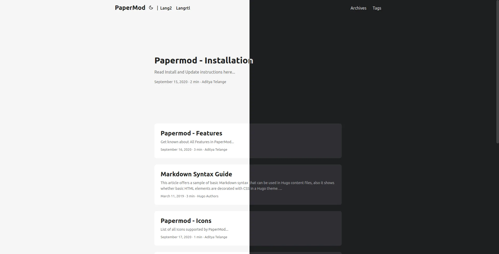
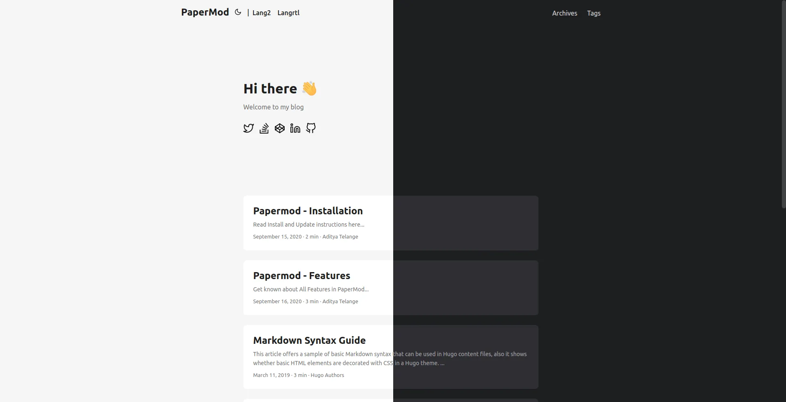
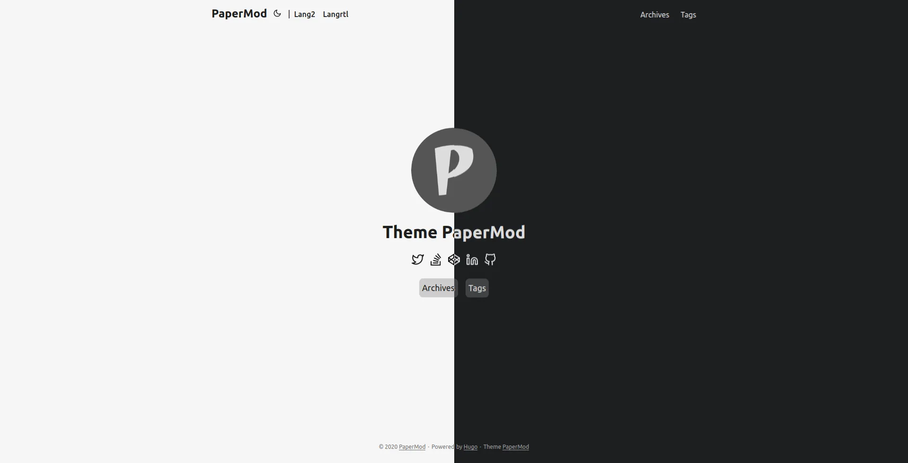

### Assets (js/css)

The following is enabled by default

-   [minification](https://gohugo.io/hugo-pipes/minification/) - makes the assets size smallest as possible.
-   [bundling](https://gohugo.io/hugo-pipes/bundling/) - bundles all the styles in one single asset
-   [fingerprint/intergity](https://gohugo.io/hugo-pipes/fingerprint/) check.

---

### Default Theme light/dark/auto

```yml
params:
    # defaultTheme: light
    # defaultTheme: dark
    defaultTheme: auto # to switch between dark or light according to browser theme
```

</details>

---

### Theme Switch Toggle (enabled by default)

Shows icon besides title of page to change theme

To disable it :

```yml
disableThemeToggle: true
```

You can refer following table for better understanding...

| `defaultTheme` | `disableThemeToggle` | checks local storage? | checks system theme? | Info              |
| -------------- | -------------------- | --------------------- | -------------------- | ----------------- |
| `auto`         | true                 | No                    | Yes                  | only system theme |
|                | false                | Yes (if not->2)       | Yes (2)              | _switch present_  |
| `dark`         | true                 | No                    | No                   | force dark only   |
|                | false                | Yes                   | No                   | _switch present_  |
| `light`        | true                 | No                    | No                   | force light only  |
|                | false                | Yes                   | No                   | _switch present_  |

---

### Archives Layout

Create a page with `archive.md` in `content` directory with following content

```yml
---
title: "Archive" # in any language you want
layout: "archives" # is necessary
url: "/archive"
summary: "archive"
---

```

**Note:** Archives Layout does not support Multilingual Month Translations.

ex: [archives.md](https://raw.githubusercontent.com/adityatelange/hugo-PaperMod/exampleSite/content/archives.md)

---

### Regular Mode (default-mode)



---

### Home-Info Mode



Use 1st entry as some Information

add following to config file

```yml
params:
    homeInfoParams:
        Title: Hi there wave
        Content: Can be Info, links, about...

    socialIcons: # optional
        - name: "<platform>"
            url: "<link>"
        - name: "<platform 2>"
            url: "<link2>"
```

ex. [here](https://github.com/adityatelange/hugo-PaperMod/blob/exampleSite/config.yml#L106)

---

### Profile Mode



Shows Index/Home page as Full Page with Social Links and Image

add following to config file

```yml
params:
    profileMode:
        enabled: true
        title: "<Title>" # optional default will be site title
        imageUrl: "<image link>" # optional
        imageTitle: "<title of image as alt>" # optional
        imageWidth: 120 # custom size
        imageHeight: 120 # custom size
        buttons:
            - name: Archive
            url: "/archive"
            - name: Github
            url: "https://github.com/"

    socialIcons: # optional
        - name: "<platform>"
            url: "<link>"
        - name: "<platform 2>"
            url: "<link2>"
```

---

### Search

Add the following to site config, `config.yml`

```yml
outputs:
    home:
        - HTML
        - RSS
        - JSON # is necessary
```

Create a page with `search.md` in `content` directory with following content

```yml
---
title: "Search" # in any language you want
layout: "search" # is necessary
# url: "/archive"
summary: "search"
---

```

For Multilingual use `search.<lang>.md` ex. `search.es.md`.

**Note:** Search will work only on current language, user is currently on !

**Customizing Fusejs Options**

Refer https://fusejs.io/api/options.html for Options, Add those as shown below.

```yml
params:
    fuseOpts:
        isCaseSensitive: false
        shouldSort: true
        location: 0
        distance: 1000
        threshold: 0.4
        minMatchCharLength: 0
        keys: ["title", "permalink", "summary", "content"]
```

ex: [search.md](https://raw.githubusercontent.com/adityatelange/hugo-PaperMod/exampleSite/content/search.md)

---

### Draft Page indication

adds `[draft]` mark to indicate draft pages.

---

### Post Cover Image

In post's page-variables add :

```yml
cover:
    image: "<image path/url>"
    # can also paste direct link from external site
    # ex. https://i.ibb.co/K0HVPBd/paper-mod-profilemode.png
    alt: "<alt text>"
    caption: "<text>"
```

When you include images in the [Page Bundle](https://gohugo.io/content-management/page-bundles/), multiple sizes of the image will automatically be provided using the HTML5 `srcset` field.

To reduce generation time and size of the site, you can disable this feature using

```yml
params:
    cover:
        responsiveImages: false
```

To enable hyperlinks to the full image size on post pages, use

```yml
params:
    cover:
        linkFullImages: true
```

---

### Share Buttons on post

Displays Share Buttons at Bottom of each post

to show share buttons add

```yml
params:
    ShowShareButtons: true
```

---

### Show post reading time

Displays Reading Time (the estimated time, in minutes, it takes to read the content.)

To show reading time add

```yml
Params:
    ShowReadingTime: true
```

---

### Show Table of Contents (Toc) on blog post

Displays ToC on blog-pages

To show ToC add following to page-variables

```yml
ShowToc: true
```

To keep Toc Open **by default** on a post add following to page-variables:

```yml
TocOpen: true
```

---

### Multiple Authors

To Use multiple authors for a post, in post-variables:

```yml
---
author: ["Me", "You"]
---

```

To use Multiple Authors Site-wide, in `config.yml`:

```yml
params:
    author: ["Me", "You"]
```

---

### Comments

to add comments, create a html file

`layouts/partials/comments.html`

and paste code provided by your comments provider

also in config add this

```yml
params:
    comments: true
```

read more about this [here](https://gohugo.io/content-management/comments/)

---

### Misc

#### Scroll-Bar themed (by default)

#### Smooth Scroll between in-page links (by default)

#### Scroll-to-Top Button (by default)

Displays a Scroll-to-Top button in right-bottom corner

#### Google Analytics integration

#### Open-Graph support

#### Twitter Cards Support

#### Syntax highlighting

#### Twitter cards and opengraph tags support

#### RSS feeds

#### Multilingual Support
