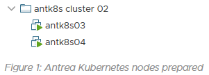

# Hugo Clarity Theme

A technology-minded theme for Hugo based on VMware's open-source [Clarity Design System](https://clarity.design/) featuring rich code support, dark/light mode, mobile support, and much more. See [a live demo at __neonmirrors.net__](https://neonmirrors.net/).


## Preview on Desktop

| Light Mode                                                                                                        | Dark Mode                                                                                                                 |
| ----------------------------------------------------------------------------------------------------------------- | ------------------------------------------------------------------------------------------------------------------------- |
|  |  |

## Preview on Mobile

| Light Mode                                                                                                              | Dark Mode                                                                                                                       |
| ----------------------------------------------------------------------------------------------------------------------- | ------------------------------------------------------------------------------------------------------------------------------- |
|  |  |

## Table of Contents

* [Features](#features)
* [Prerequisites](#prerequisites)
* [Getting up and running](#getting-up-and-running)
* [Configuration](#configuration)
  * [Global Parameters](#global-parameters)
  * [Page Parameters](#page-parameters)
  * [Menus](#modify-menus)
    * [Main Menu](#main-menu)
    * [Social media](#social-media)
  * [Search Engine](#search-engine)
  * [Blog directory](#blog-directory)
  * [Mobile menu positioning](#mobile-menu-positioning)
  * [Tags and taxonomies](#tags-and-taxonomies)
  * [Images](#images)
    * [Organizing page resources](#organizing-page-resources)
    * [Modern image formats](#support-for-modern-image-formats)
    * [Image captions](#image-captions)
    * [Adding figure positions to image captions](#adding-figure-positions-to-image-captions)
    * [Inline images](#inline-images)
    * [Floating images](#float-images-to-the-left)
    * [Round borders](#round-borders-for-images)
    * [Adding CSS classes](#add-classes-to-images)
    * [Featured image](#featured-image)
    * [Thumbnail image](#thumbnail-image)
    * [Share image](#share-image)
    * [Logo alignment](#logo-alignment)
  * [Code](#code)
  * [Table of contents](#table-of-contents-1)
  * [Pinning featured posts](#pinning-featured-posts)
  * [Notices](#notices)
  * [Custom CSS and JS](#custom-css-and-js)
  * [Custom Site Disclaimer](#site-disclaimer)
  * [Forcing light or dark mode](#forcing-light-or-dark-mode)
  * [Internationalization - I18N](#i18n)
  * [Hooks](#hooks)
  * [Comments](#comments)
  * [Math notation](#math-notation)
  * [Open Street Map](#map)
  * [Search](#search)
* [Contributing](#contributing)
* [Code of conduct](#code-of-conduct)
* [License](#license)

## Features

* Blog with tagging and category options

* Search

* Deeplinks

* Choice of whether to use [Hugo Page Bundles](https://gohugo.io/content-management/page-bundles/)

* Native image lazy-loading

* Customizable (see config)

* Dark mode (with UI controls for user preference setting)

* Toggleable table of contents

* Toggleable automatic figure numbering

* Configurable site disclaimer (i.e. "my views are not my employer's")

* Flexible image configuration, and support for modern formats like WebP

* Logo alignment

* Mobile support with configurable menu alignment

* Syntax highlighting

* Rich code block functions including:

  1. Copy to clipboard

  2. Toggle line wrap (dynamic)

  3. Toggle line numbers

  4. Language label

  5. Toggle block expansion/contraction (dynamic)

     To put it all in context, here is a preview showing all functionality.

     

## Prerequisites

Firstly, __ensure you have installed the [extended version of Hugo 0.91.0 or above](https://github.com/gohugoio/hugo/releases)__. See installation steps from [Hugo's official docs](https://gohugo.io/getting-started/installing/) for more information. Note that software repositories may be several versions behind and may not include the extended version.

## Getting up and running

Read the [prerequisites](#prerequisites) above and verify you're using the __extended version of Hugo 0.91.0 or newer__.

There are several ways to use this theme:

### Option 1a: Development in the browser

[](https://gitpod.io/#https://github.com/chipzoller/hugo-clarity)

For trying out the theme, quick experimentation, and to contribute Pull Requests, Gitpod is the easiest option. Use the button above and it will spin up a prebuilt environment with a site ready to go.

If you want to contribute a PR, [this is a good overview of that process](https://jldec.me/using-gitpod-to-create-a-pr), and there's also an [optional browser extension](https://www.gitpod.io/docs/browser-extension). [Read more about contributing to Hugo Clarity](CONTRIBUTING.md)

### Option 1b: Development on your machine

If you prefer not to use Gitpod, you can also test, develop and contribute PRs locally from your computer.

```bash
git clone https://github.com/chipzoller/hugo-clarity
cd hugo-clarity/exampleSite/
hugo server --themesDir ../..
```

> Note that while this is a good way to work on Hugo Clarity, isn't a good way to work on your own site, since it uses the content from `exampleSite`, and wouldn't be aware of any overrides your site might apply to the theme.

[Read more about contributing to Hugo Clarity](CONTRIBUTING.md)

### Option 2: Hugo modules

This option arguably requires the least effort to run and maintain your website with the Hugo Clarity theme.

We assume you've already run `hugo new site <sitename>` and are in the `<sitename>` directory.

1. Ensure you have the `go` binary [installed on your machine](https://golang.org/doc/install). (Mac users: ```brew install go```.)

2. Run the following command:
```bash
hugo mod init <sitename>
```

3. Hugo Clarity comes with [`exampleSite` files](https://github.com/chipzoller/hugo-clarity/tree/master/exampleSite) prefilled with helpful configuration and sample posts. If you're starting a new Hugo site and don't have any content yet, it's easiest to grab the whole thing:
```bash
wget -O - https://github.com/chipzoller/hugo-clarity/archive/master.tar.gz | tar xz && cp -a hugo-clarity-master/exampleSite/* . && rm -rf hugo-clarity-master && rm -f config.toml
```
If you are using PowerShell, paste this instead:
```bash
wget -O - https://github.com/chipzoller/hugo-clarity/archive/master.tar.gz | tar xz -and cp -a hugo-clarity-master/exampleSite/* . -and rm -rf hugo-clarity-master -and rm -f config.toml
```
If you do already have a site and don't want to risk overwriting anything, we suggest copying the contents of [`config`](exampleSite/config/) over, as well as replacing your `archetypes/post.md` (if it exists) with [Hugo Clarity's](exampleSite/archetypes/post.md). Then migrate any necessary settings from `<sitename>/config.toml` to `<sitename>/config/_default/config.toml` and remove the original `<sitename>/config.toml` file.

4. Open `<sitename>/config/_default/config.toml` and change `theme = "hugo-clarity"` to `theme = ["github.com/chipzoller/hugo-clarity"]`

5. You can now run:
```bash
hugo server
```

If that seems like a lot of setup, it's meant to reduce the pain of pulling in new versions of Hugo Clarity when they are released.

To pull in theme updates, run `hugo mod get -u github.com/chipzoller/hugo-clarity`. You can also update all your Hugo modules with `hugo mod get -u ./...` -- [read more about updating Hugo modules](https://gohugo.io/hugo-modules/use-modules/#update-modules).

> There is [more you can do with hugo modules](https://github.com/rootwork/hugo-module-site), but this will suffice for our use case here.

### Option 3: Git submodules

For those not ready to use Hugo modules, you can use the "old way" using git alone.

We assume you've already run `hugo new site <sitename>`, are in the `<sitename>` directory, and have a working git repo (`git init`).

1. Run:
```bash
git submodule add https://github.com/chipzoller/hugo-clarity themes/hugo-clarity
```

2. Hugo Clarity comes with [`exampleSite` files](https://github.com/chipzoller/hugo-clarity/tree/master/exampleSite) prefilled with helpful configuration and sample posts. If you're starting a new Hugo site and don't have any content yet, it's easiest to grab the whole thing:
```bash
cp -a themes/hugo-clarity/exampleSite/* . && rm -f config.toml
```
If you do already have a site and don't want to risk overwriting anything, we suggest copying the contents of [`config`](exampleSite/config/) over, as well as replacing your `archetypes/post.md` (if it exists) with [Hugo Clarity's](exampleSite/archetypes/post.md). Then migrate any necessary settings from `<sitename>/config.toml` to `<sitename>/config/_default/config.toml` and remove the original `<sitename>/config.toml` file.

3. You can now run:
```bash
hugo server
```

While this is less setup than option 2 initially, it comes with important caveats. First, to pull in new versions of the theme, you'll need to run `git submodule update --remote --merge` _and commit those changes to your git repo_. Second, if you clone your repo to another machine, have multiple people working on your site, or have a continuous-integration or deployment script (like Netlify), after cloning you'll need to also remember to run `git submodule update --init --recursive` to get the theme files.

See [an overview of using git submodules for Hugo themes](https://www.andrewhoog.com/post/git-submodule-for-hugo-themes/) and [troubleshooting git submodules in Hugo themes](https://study.impl.dev/hacking/git-submodule-hugo-theme/) for details.

## Configuration

Hugo Clarity uses a config folder rather than a single file. If you're used to having a `config.toml` file in your main folder, now you'll find that located in `config/_default/config.toml`, along with other settings files.

This section will mainly cover settings that are unique to this theme. If something is not covered here (or elsewhere in this file), there's a good chance it is covered in [this Hugo docs page](https://gohugo.io/getting-started/configuration/#configuration-file).

### Global Parameters

These options set global values that some pages or all pages in the site use by default.

| Parameter                  | Value Type                  | Overridable on Page |
|:-------------------------- | --------------------------- | ------------------- |
| author                     | map / string                | no                  |
| twitter                    | string                      | no                  |
| largeTwitterCard           | boolean                     | no                  |
| ga_analytics               | string                      | no                  |
| google_tag_manager_id      | string                      | no                  |
| baidu_analytics            | string                      | no                  |
| plausible_analytics        | boolean                     | no                  |
| matomo_analytics           | boolean                     | no                  |
| umami_data_website_id      | string                      | no                  |
| description                | string                      | yes                 |
| keywords                   | array of strings            | yes                 |
| introDescription           | string                      | yes                 |
| introURL                   | string/false                | no                  |
| numberOfTagsShown          | integer                     | no                  |
| usePageBundles             | boolean                     | yes                 |
| fallBackOgImage            | file path (string)          | no                  |
| codeMaxLines               | integer                     | yes                 |
| codeLineNumbers            | boolean                     | yes                 |
| mainSections               | array/string                | no                  |
| centerLogo                 | boolean                     | no                  |
| logo                       | file path (string)          | no                  |
| iconsDir                   | dir path (string)           | no                  |
| mobileNavigation           | string                      | no                  |
| figurePositionShow         | boolean                     | yes                 |
| figurePositionLabel        | string                      | no                  |
| customCSS                  | array of file path (string) | no                  |
| customJS                   | array of file path (string) | no                  |
| enforceLightMode           | boolean                     | N/A                 |
| enforceDarkMode            | boolean                     | N/A                 |
| titleSeparator             | string                      | no                  |
| showShare                  | boolean                     | yes                 |
| comments                   | boolean                     | yes                 |
| numberOfRecentPosts        | integer                     | no                  |
| numberOfFeaturedPosts      | integer                     | no                  |
| pinFeatured                | boolean                     | no                  |
| numberOfPinnedPosts        | integer                     | no                  |
| dateFormat                 | string                      | no                  |
| enableMathNotation         | boolean                     | yes                 |
| customFonts                | boolean                     | no                  |
| since                      | integer                     | N/A                 |
| rss_summary                | boolean                     | N/A                 |
| rss_summary_read_more_link | boolean                     | N/A                 |
| showRelatedInArticle       | boolean                     | yes                 |
| showRelatedInSidebar       | boolean                     | no                  |
| footerLogo                 | string                      | N/A                 |
| enableSearch               | boolean                     | N/A                 |
| blogDir                    | string                      | no                  |
| cdn                        | map                         | no                  |

### Page Parameters

These options can be set from a page [frontmatter](https://gohugo.io/content-management/front-matter#readout) or via [archetypes](https://gohugo.io/content-management/archetypes/#readout).

| Parameter            | Value Type         | Overrides Global |
|:-------------------- | ------------------ | ---------------- |
| title                | string             | N/A              |
| date                 | date               | N/A              |
| lastmod              | date               | N/A              |
| description          | string             | N/A              |
| keywords             | array of strings   | yes              |
| introDescription     | string             | yes              |
| abstract             | string             | N/A              |
| summary              | string             | N/A              |
| draft                | boolean            | N/A              |
| featured             | boolean            | N/A              |
| tags                 | array/string       | N/A              |
| categories           | array/string       | N/A              |
| toc                  | boolean            | N/A              |
| usePageBundles       | boolean            | yes              |
| featureImage         | file path (string) | N/A              |
| featureImageAlt      | string             | N/A              |
| featureImageCap      | string             | N/A              |
| thumbnail            | file path (string) | N/A              |
| shareImage           | file path (string) | N/A              |
| codeMaxLines         | integer            | yes              |
| codeLineNumbers      | boolean            | yes              |
| figurePositionShow   | boolean            | yes              |
| figurePositionLabel  | string             | no               |
| comments             | boolean            | yes              |
| enableMathNotation   | boolean            | yes              |
| showDate             | boolean            | N/A              |
| showLastmod          | boolean            | N/A              |
| lastmodSeparator     | string             | N/A              |
| showShare            | boolean            | N/A              |
| showReadTime         | boolean            | N/A              |
| sidebar              | boolean            | N/A              |
| singleColumn         | boolean            | N/A              |
| showRelatedInArticle | boolean            | N/A              |
| noindex              | boolean            | N/A              |

### Modify Menus

#### Main Menu

To add, remove, or reorganize top menu items, [edit the files here](https://github.com/chipzoller/hugo-clarity/tree/master/exampleSite/config/_default/menus). Specifically look for items with `[[main]]`.

If you prefer the more [traditional approach](https://gohugo.io/content-management/menus/#readout), delete `content\config` folder and enter a [main menu entry](https://gohugo.io/content-management/menus/#add-non-content-entries-to-a-menut) inside the `config.toml` file

#### Social media

To edit your social media profile links, edit the files referenced above. Specifically, look for items with `[[social]]`

If you wish to globally use a [large Twitter summary card](https://developer.twitter.com/en/docs/twitter-for-websites/cards/overview/summary-card-with-large-image) when sharing posts, set the global parameter `largeTwitterCard` to `true`.

### Web site analytics

If using Google Analytics, configure the `ga_analytics` global parameter in your site with your ID. You can opt to set a google tag manager using `google_tag_manager_id`.

If using Baidu Analytics, configure the `baidu_analytics` global parameter in your site with your ID.

If using Plausible Analytics, configure the `plausible_analytics` global parameters in your site with the following.

`enable` To enable plausible analytics change to `true`.

`websiteDomain` Set domain name of your website, most cases same as your base URL this is required.

`plausibleDomain`  Default is set to plausible.io, this parameter is only required if plausible is self-hosted.

`scriptName`  Default is set to plausible, this parameter is only required if using a custom name for script.

If using Matomo Analytics, configure the `matomo_analytics` global parameters in your site with the following.

`enable` To enable matomo analytics change to `true`.

`websiteDomain` Set the domain name of your website, in most cases same as your base URL this is required.

`matomoDomain`   Set to Matomo domain

`matomoSiteID`  Default is set to 1, change this to the siteid being tracked

If using [Umami Analytics](https://umami.is/), uncomment and configure the following in *params.toml*:

* `umami_data_website_id` - The data website ID provided in the script by Umami.  It should be in the form of a GUID (# characters):  8-4-4-4-12.
* `umami_script_url` - This is pre-loaded with the cloud-hosted Umami Script URL, but can be changed if you are self-hosting.

> NOTE:  The head partial only loads analytics if the hugo environment is NOT `development`.  

### Blog directory

Edit `params.toml` and change the `mainSections` key. Values will be directories where the blogs reside.

```yaml
...
mainSections = ["posts", "docs", "blogs"]
...
```

For more info, see the [Hugo docs](https://gohugo.io/functions/where/#mainsections).

### Mobile menu positioning

The navigation menu when mobile browsing can be configured in `config.toml` to open right or left depending on preference. The "hamburger" menu icon will always display in the upper right hand corner regardless.

```yaml
[params]
...
mobileNavigation = "left" # Mobile nav menu will open to the left of the screen.
...
```

### Tags and Taxonomies

#### Show number of tags

The number of tags and taxonomies (including categories) that should be shown can be configured so that any more than this value will only be accessible when clicking the All Tags button. This is to ensure a large number of tags or categories can be easily managed without consuming excess screen real estate. Edit the `numberOfTagsShown` parameter and set accordingly.

```yaml
[params]
...
numberOfTagsShown = 14 # Applies for all other default & custom taxonomies. e.g categories, brands see https://gohugo.io/content-management/taxonomies#what-is-a-taxonomy
...
```

#### Number of tags example


### Images

A number of CSS classes are automatically added to images based on their source or type to aid you in any tweaks to the theme. These include:

- `image_figure` when the image appears inside a `<figure>` element
- `image_internal` when the image is local, within the site
- `image_external` when the image is loaded from a URL
- `image_processed` when the image has been passed through [Hugo Pipes](https://gohugo.io/hugo-pipes/introduction/) (requires the image to be using page bundles or be in the `assets` directory)
- `image_unprocessed` when the image has not been passed through Hugo Pipes
- `image_thumbnail` when the image is in a list of content excerpts
- `image_featured` when the image is a banner or hero image at the top of a post
- `image_svg` when the image is an [SVG](https://en.wikipedia.org/wiki/Scalable_Vector_Graphics) (and thus [cannot be run through Hugo Pipes](https://github.com/gohugoio/hugo/issues/3700))

Most images in Hugo Clarity are loaded [lazy](https://developer.mozilla.org/en-US/docs/Web/Performance/Lazy_loading#images_and_iframes) and [asynchronously](https://developer.mozilla.org/en-US/docs/Web/API/HTMLImageElement/decoding) to improve site speed. Images that are not loaded in this manner include the site's logo.

Images, whether used within Markdown content or using parameters like `featureImage` or `thumbnail`, can be local or remote images. Remote images (starting with `http...`) will automatically be downloaded, stored and optimized by Hugo Clarity, so that the finished site will only serve local images.

#### Organizing page resources

By default, Hugo Clarity assumes that page resources -- images and other related files -- are stored in the `static` or `assets` directories. Alternatively, you can opt-in to using [Hugo page bundles](https://gohugo.io/content-management/page-bundles/) by setting the `usePageBundles` option to `true` in your site parameters. Using this method, you keep a post's assets in the same directory as the post itself.

If you have an existing site that is not using page bundles but would like to start with new posts, `usePageBundles` can be overridden at the post level in the front matter. If it is not set in the post, it will default to the site's parameter. Take a look at [`exampleSite/content/post/bundle/index.md`](exampleSite/content/post/bundle/index.md) for more information and an example of overriding this setting on an individual post.

#### Support for modern image formats

If you are using page bundles (see above) and reference `sample.jpg` in your post, Hugo Clarity will check to see if the same image (based on filename) exists in the modern formats of [WebP](https://en.wikipedia.org/wiki/WebP), [AVIF](https://en.wikipedia.org/wiki/AVIF) or [JXL](https://en.wikipedia.org/wiki/JPEG_XL). If it does, these will be presented to browsers as alternative options. Browsers that [support these formats and the `<picture>` element](https://developer.mozilla.org/en-US/docs/Web/HTML/Element/picture#the_type_attribute) will load them, while browsers that do not will fall-back to the default image.

Note that this does not *create* the other versions of the image for you, it simply checks to see if they exist. You may want to automate this process in your site build; [here is one example](https://github.com/rootwork/rootwork.org/blob/main/scripts/image_optimize.sh).

#### Image captions

Image captions are automatically generated. If an image has title text, the caption will be created from it; if an image has no title text, the alt text will be used. To display an image with alt text but no caption, use title text of a single space (`" "`).

Examples of captions:

- `` will display the local `jane-doe.png` image with a caption of "Jane Doe".
- `` will display the remote image `jane-doe.png` with a caption of "This is Jane Doe".
- `` will display the local image `building.png` with no caption.

Examples of this can also be found in the "Markdown Syntax Guide" post in the example site content.

> NOTE: Due to limitations in Markdown, single and double quotes should not be used within alt or title text.

#### Adding figure positions to image captions

You have the option of prepending a desired string such as "Figure N" to the caption text of images within an article's content.

Two global settings control this feature:

- `figurePositionLabel` is a string which will be prepended to any caption text of an article image; by default this is set to "Figure".
- `figurePositionShow` controls, globally, whether to show this label. (It does not affect the visibility of image captions in general, only the prepended figure position text.) For more granular control, `figurePositionShow` can be overridden at the article level if desired.

Figure numbers will be automatically inserted after the `figurePositionLabel` text, starting from the top of the article and increasing as you move down.

#### Example of image with figure positions added

Assume that `figurePositionLabel` is set to "Figure" in `config.toml` and this is the first image in a given article.

```markdown

```


#### Inline images

To make an image inline, append `:inline` to its alt text.

#### Inline images example

```markdown
<!-- an inline image without alt text -->


<!-- an inline image with alt text -->


```


#### Float images to the left

To align a blog image to the left, append `:left` to its alt text. Article text will then flow to the right of the image.

#### Float images left example

```markdown
<!-- a left-floated image without alt text -->


<!-- a left-floated image with alt text -->


```

#### Float images to the right

To align a blog image to the right, append `:right` to its alt text. Article text will then flow to the left of the image.

#### Float images right example

```markdown
<!-- a right-floated image without alt text -->


<!-- a right-floated image with alt text -->


```

#### Round borders for images

To make the image borders round, append `::round` to its alt text. This is a
pre-defined image class commonly used to display portrait images. Note that round
is just another class and it can be mixed with other classes separated by space.

#### Round borders for images example

```markdown
<!-- an image without alt text and round borders-->


<!-- an image with alt text and round borders-->


<!-- a left-floating image without alt text and with round borders-->


```

#### Add classes to images

To add a CSS class to an image, append `::<classname>` to its alt text. You can also add multiple classes to an image separated by space. `::<classname1> <classname2>`.

#### Image classes example

```markdown
<!-- an image without alt text -->


<!-- an image with alt text -->


```

#### Featured image

Each article can specify an image that appears at the top of the content.

```yaml
...
featureImage: "images/2020-04/capv-overview/featured.jpg"
...
```

The path for the featured image is relative to the `static` directory if not using [Page Bundles](#organizing-page-resources), and relative to the post's own directory if using them.

Two other frontmatter settings allow you to set alt text for the featured image and an optional caption.

```yaml
...
featureImageAlt: 'Text describing the featured image' # Alternative text for featured image.
featureImageCap: 'A caption appearing below the image.' # Caption (optional).
...
```

Unless specified using `featureImageCap`, a caption will not be generated for the featured image.

#### Thumbnail image

Each article can specify a thumbnail image which will be displayed on the left of the article's card on the home page and in lists of articles.

```yaml
...
thumbnail: "images/2020-04/capv-overview/thumbnail.jpg"
...
```

Thumbnails look best when square (height:width ratio of 1:1) and at least 150x150 pixels.

The path for the thumbnail image is relative to the `static` directory if not using [Page Bundles](#organizing-page-resources), and relative to the post's own directory if using them.

#### Share image

Each article can specify a share image which will used when the article is shared on social media.

```yaml
...
shareImage: "images/theImageToBeUsedOnShare.png"
...
```

If a share image is not specified, the order of precedence that will be used to determine which image applies is `thumbnail` => `featureImage` => `fallbackOgImage`. That is, if no thumbnail is specified, the featured image will be used; if neither is specified, the fallback image will be used.

When sharing a link to the home page of the site (as opposed to a specific article), the `fallbackOgImage` will be used.

The path for the share image is relative to the `static` directory if not using [Page Bundles](#organizing-page-resources), and relative to the post's own directory if using them.

#### Logo alignment

You can left align or center your site's logo.

```yaml
...
centerLogo = true # Change to false to align left
...
```

If no logo is specified, the title of the site will appear in its place.

### Code

#### Display line numbers

Choose whether to display line numbers within a code block globally with the parameter `codeLineNumbers` setting to `true` or `false`.

```yaml
[params]
...
codeLineNumbers = true # Shows line numbers for all code blocks globally.
...
```

#### Limit code block height

You can globally control the number of lines which are displayed by default for your code blocks. Code which has the number of lines exceed this value will dynamically cause two code block expansion buttons to appear, allowing the user to expand to full length and contract. This is useful when sharing code or scripts with tens or hundreds of lines where you wish to control how many are displayed. Under params in `config.toml` file, add a value as follows:

```yaml
[params]
...
codeMaxLines = 10 # Maximum number of lines to be shown by default across all articles.
...
```

> If the value already exists, change it to the desired number. This will apply globally.

If you need more granular control, this parameter can be overridden at the blog article level. Add the same value to your article frontmatter as follows:

```yaml
...
codeMaxLines = 15 # Maximum number of lines to be shown in code blocks in this blog post.
...
```

If `codeMaxLines` is specified both in `config.toml` and in the article frontmatter, the value specified in the article frontmatter will apply to the given article. In the above example, the global default is `10` and yet the article value is `15` so code blocks in this article will auto-collapse after 15 lines.

If `codeMaxLines` is not specified anywhere, an internal default value of `100` will be assumed.

#### Line Highlighting

It is possible to highlight specific lines in a code block by applying `{hl_lines=[7]}` after the fence and language. For example, the below snippet will highlight lines 7 and 8 in the code block to which it is applied.

```
```yaml {hl_lines=[7,8]}
```

Ranges are also supported by quoting the range inside the braces.

```
```yaml {hl_lines=["7-18"]}
```

### Table of contents

Each article can optionally have a table of contents (TOC) generated for it based on top-level links. By configuring the `toc` parameter in the article frontmatter and setting it to `true`, a TOC will be generated only for that article. The TOC will then render under the featured image.

#### Table of contents (TOC) example


### Pinning featured posts

This allows you to show the featured posts at the top of the post list.

Use the [site configuration option](#global-parameters) `pinFeatured` to enable/disable it, and the option `numberOfPinnedPosts` to control how many posts to be pinned.

### Custom CSS and JS

To minimize HTTP requests per page, we would recommend loading CSS styles and JavaScript helpers in single bundles. That is to say, one CSS file and one JavaScript file. Using Hugo minify functions, these files will be minified to optimize the size.

Going by the above 👆🏻 reason, we recommend adding custom CSS and JS via these files:

1. [`_override.sass`](https://github.com/chipzoller/hugo-clarity/blob/master/assets/sass/_override.sass).
    This file should only be used to override sass & css variables e.g theme colors
2. [`_custom.sass`](https://github.com/chipzoller/hugo-clarity/blob/master/assets/sass/_custom.sass).
    This file should only be used to override everything else except sass & css variables.
3. [`custom.js`](https://github.com/chipzoller/hugo-clarity/blob/master/assets/js/custom.js).

> __Pro Tip__: Ensure that your changes are git trackable by creating these files outside the theme directory. That is, at the root level of your site's directory. See tree below.

```
├── yourSite
│   ├── archetypes
│   │   └── post.md
│   ├── assets
│   │   ├── js
│   │   │   └── custom.js
│   │   └── sass
│   │       ├── _custom.sass
│   │       └── _override.sass
│   ├── config
│   │   └── _default
│   │       ├── config.toml
│   │       ├── configTaxo.toml
│   │       ├── languages.toml
│   │       ├── markup.toml
│   │       ├── menus
│   │       │   ├── menu.en.toml
│   │       │   └── menu.pt.toml
│   │       └── params.toml
│   ├── content
│   │   ├── _index.md
```

However, sometimes you may need to load additional style or script files. In such cases, you can add custom `.css` and `.js` files by listing them in the `config.toml` file (see the snippet below). Similar to images, these paths should be relative to the `static` directory.

```yaml
[params]
...
customCSS = ["css/custom.css"] # Include custom CSS files
customJS = ["js/custom.js"] # Include custom JS files
...
```

### Notices

This theme includes functionality to display some "highlight blocks" - called "notices" using a shortcode.

For example, see the shortcode markup below will render as a notice:

```
{}
This will be the content of the note.
{}
```

For more examples see the "Notices" page in the `exampleSite`.

### Site Disclaimer

 The theme includes the ability to put a Disclaimer on your website (e.g. "My views are my own and not my employer's").  Currently, the disclaimer displays in the sidebar under the author information.   You can enable and customize it as follows:

 * Uncomment the `sidebardisclaimer` parameter in `config/_default/params.toml`.
 * Uncomment and edit the `disclaimerText` parameter in `config/_default/params.toml`.
 * Add and modify an override for the `div.sidebardisclaimer` selector in `assets/saas/_custom.sass`.

 ```CSS
div.sidebardisclaimer{padding: 0px 10px 15px 10px;margin: 20px 5px 20px 5px;border: 1px solid #eee;border-left-width: 10px;border-right-width: 10px;border-radius: 5px 5px 5px 5px;border-left-color: orange;border-right-color: orange;border-top-color:orange;border-bottom-color:orange}
 ```

 > The code for the sidebar disclaimer text is in `layouts/partials/sidebar.html`.  The default color scheme displays in both light and dark mode.   Additionally, the styling has been placed into `_custom.sass` so that it's easily editable with beginner's understanding of CSS properties and easier to find.

### Forcing light or dark mode

By default, sites authored using Clarity will load in the browser with the user's system-wide settings. I.e., if the underlying OS is set to dark mode, the site will automatically load in dark mode. Regardless of the default mode, a UI control switch exists to override the theme mode at the user's discretion.

In order to override this behavior and force one mode or another, add either `enforceLightMode` or `enforceDarkMode` to your `config.toml` file. If neither value is present, add it.

To enforce Light Mode by default, turn `enforceLightMode`  to `true`.

To enforce Dark Mode by default, turn `enforceDarkMode`  to `true`

```yaml
[params]
...
enforceLightMode = true # Force the site to always load in light mode.
...
```

Please note that you cannot enforce both modes at the same time. It wouldn't make sense, would it?

> ⚠️ Please also note that the mode toggle UI will remain in place. That way, if a user prefers dark mode, they can have their way. The best of both worlds.

### I18N

This theme supports Multilingual (i18n / internationalization / translations)

The `exampleSite` gives you some examples already.
You may extend the multilingual functionality by following the [official documentation](https://gohugo.io/content-management/multilingual/).

Things to consider in multilingual:

* **supported languages** are configured in [config/_default/languages.toml](./exampleSite/config/_default/languages.toml)
* **add new language support** by creating a new file inside [i18n](./i18n/) directory.
  Check for missing translations using `hugo server --i18n-warnings`
* **taxonomy** names (tags, categories, etc...) are translated in [i18n](./i18n/) as well (translate the key)
* **menus** are translated manually in the config files [config/_default/menus/menu.xx.toml](./exampleSite/config/_default/menus/)
* **menu's languages list** are semi-hardcoded. You may chose another text for the menu entry with [languageMenuName](./exampleSite/config/config.toml). Please, do better and create a PR for that.
* **content** must be translated individually. Read the [official documentation](https://gohugo.io/content-management/multilingual/#translate-your-content) for information on how to do it.

**note:** if you do NOT want any translations (thus removing the translations menu entry), then you must not have any translations.
In the exampleSite that's as easy as removing the extra translations from the `config/_default/...` or executing this one-liner:

```sh
sed '/^\[pt]$/,$d' -i config/_default/languages.toml && rm config/_default/menus/menu.pt.toml
```

To change the values of translatable text, such as `read_more` or `copyright`, edit the values in the language file you are using in the [`i18n`](i18n) directory. If you have no such directory, copy the one inside the theme to your root Hugo directory.

### Hooks

Clarity provides some hooks for adding code on a page.

If you need to add some code (CSS import, HTML meta or similar) to the head section on every page, add a partial to your project:

```
layouts/partials/hooks/head-end.html
```

Similar, if you want to add some code right before the body end (e.g fonts' links), create your own version of the following file:

```
layouts/partials/hooks/body-end.html
```

### Comments

Clarity supports Hugo built-in Disqus partial. You can enable Disqus simply by setting [`disqusShortname`](https://gohugo.io/templates/internal/#configure-disqus) in your [configuration file](https://github.com/chipzoller/hugo-clarity/blob/88f6cf4ac37c12990983b92d19842524555c23d3/exampleSite/config/config.toml#L11).

You can also override [layouts/partials/comments.html](https://github.com/chipzoller/hugo-clarity/blob/master/layouts/partials/comments.html) to take advantage of [disqus comments Alternatives](https://gohugo.io/content-management/comments/#comments-alternatives) for details.

> Please leave `#disqusShortname = ""` commented out if you decide to use other comments tools

You can disable them site-wide by setting `comments = false` under `[params]` from config.toml file and vice versa. Omitting that setting will default to comments will be enabled.

You can override these setting from each post individually. For example, you may want to disable/enable comments on specific posts. Use the same syntax used on the config.toml file.

> please use `comments` and not `comment`

#### Utterances Commenting Support

If you wish use [Utterances](https://github.com/utterance/utterances) comments on your site, you'll need to perform the following:

 * Ensure you have a GitHub public repository, which you've granted permissions to the [Utterances GitHub App](https://github.com/apps/utterances).
 * Comment out the line for `disqusShortname = ""` in the `/config/_default/config.toml` file.
 * Set `comments = true` in the `/config/_default/params.toml` file.
 * Configure the utterances parameters in the `/config/_default/params.toml` file.
 * Optionally, you can choose a label that will be assigned to all issues created by Utterances. The label must exist in your Github repository, as Utterances cannot attach labels that do not exist. Configure `utterancesLabel` parameter in `/config/_default/params.toml` file, after you have added a label to your Github repository Issues labels. Labels are case sensitive and support Emoji in label names. ✨💬✨

Utterances is loaded in the `comments.html` partial by referring to the `utterances.html` partial.   Since `single.html` layout loads comments if comments are enabled, you must ensure *both* the `comments` and `utterances` parameters are configured.

#### Giscus Commenting Support

If you wish to use [giscus](https://giscus.app/) comments on your site, you'll need to perform the following:

 * Ensure your repository is [public](https://docs.github.com/en/github/administering-a-repository/managing-repository-settings/setting-repository-visibility#making-a-repository-public), otherwise visitors will not be able to view the discussion.
 * The [giscus app](https://github.com/apps/giscus) is installed, otherwise visitors will not be able to comment and react.
 * The Discussions feature is turned on by [enabling it for your repository](https://docs.github.com/en/github/administering-a-repository/managing-repository-settings/enabling-or-disabling-github-discussions-for-a-repository).
 * Comment out the line for `disqusShortname = ""` in the `/config/_default/config.toml` file.
 * Set `comments = true` in the `/config/_default/params.toml` file.
 * Configure the giscus parameters in the `/config/_default/params.toml` file.

Giscus is loaded in the `comments.html` partial by referring to the `giscus.html` partial.   Since `single.html` layout loads comments if comments are enabled, you must ensure *both* the `comments` and `giscus` parameters are configured.


### Math notation

Clarity uses [KaTeX](https://katex.org/) for math type setting if `enableMathNotation` is set to `true` in global or page parameters (the latter takes precedence).

Also see [supported TeX commands in KaTeX](https://katex.org/docs/supported.html).

If you want chemical typesetting provided by the [`mhchem`](https://mhchem.github.io/MathJax-mhchem/) extension, first copy `[site]/themes/clarity/layouts/partials/math.html` to `[site]/layouts/partials/math.html`:

```bash
# cd /path/to/site
mkdir -p layouts/partials && cp themes/clarity/layouts/partials/math.html layouts/partials/math.html
```

Then add the corresponding line as its [README](https://github.com/KaTeX/KaTeX/tree/master/contrib/mhchem) suggested (without the `+` sign):

```diff
<link rel="stylesheet" href="https://cdn.jsdelivr.net/npm/katex@0.16.11/dist/katex.min.css" integrity="sha384-AfEj0r4/OFrOo5t7NnNe46zW/tFgW6x/bCJG8FqQCEo3+Aro6EYUG4+cU+KJWu/X" crossorigin="anonymous">

<script defer src="https://cdn.jsdelivr.net/npm/katex@0.16.11/dist/katex.min.js" integrity="sha384-nB0miv6/jRmo5UMMR1wu3Gz6NLsoTkbqJghGIsx//Rlm+ZU03BU6SQNC66uf4l5+" crossorigin="anonymous"></script>

+ <script defer src="https://cdn.jsdelivr.net/npm/katex@0.16.11/dist/contrib/mhchem.min.js" integrity="sha384-ifpG+NlgMq0kvOSGqGQxW1mJKpjjMDmZdpKGq3tbvD3WPhyshCEEYClriK/wRVU0" crossorigin="anonymous"></script>

<script defer src="https://cdn.jsdelivr.net/npm/katex@0.16.11/dist/contrib/auto-render.min.js" integrity="sha384-43gviWU0YVjaDtb/GhzOouOXtZMP/7XUzwPTstBeZFe/+rCMvRwr4yROQP43s0Xk" crossorigin="anonymous"
  onload="renderMathInElement(document.body);"></script>
```

The added line should be _before_ `auto-render.min.js` and _after_ `katex.min.js`.

#### MathJax

The new version of MathJax has [comparable performance](https://www.intmath.com/cg5/katex-mathjax-comparison.php?processor=MathJax3) to KaTeX and better support for TeX commands.

If you prefer MathJax, create a blank `[site]/layouts/partials/math.html` and add the following two lines:

```html
<script src="https://polyfill.io/v3/polyfill.min.js?features=es6"></script>
<script id="MathJax-script" async src="https://cdn.jsdelivr.net/npm/mathjax@3/es5/tex-mml-chtml.js"></script>
```

This file will [take precedence over](https://gohugobrasil.netlify.app/themes/customizing/) the one Clarity provides and the site will load MathJax instead of KaTeX.

### Related Content

Related content within a `series` taxonomy can be shown at the end of a piece of content, or optionally on the sidebar above the Related Content section.

The site configuration option `showRelatedInArticle` controls if this option is enabled. The same configuration option can be used in a posts frontmatter to disable the feature (but the site configuration overrides the per-page option).

Likewise, the site configuration option `showRelatedInSidebar` controls if related content is shown on the sidebar. There is no corresponding option within a post to disable this.

### Maps

#### Creating and including a map

First create a map for free on https://umap.openstreetmap.fr/en/. Then include this map by using the `openstreetmap` shortcode, e.g. ``

#### Options

The only required parameter is `mapName`. All other parameters are completely optional.

Available parameters are:
- `coordX` (default `auto`)
- `coordY` (default `auto`)
- `scale`  (default `auto`)
- `scaleControl` (default `true`)
- `miniMap` (default `false`)
- `scrollWheelZoom` (default `true`)
- `zoomControl` (default `true`)
- `allowEdit` (default `false`)
- `moreControl` (default `true`)
- `searchControl` (default `true`)
- `tilelayersControl` (default `null`)
- `embedControl` (default `null`)
- `datalayersControl` (default `true`)
- `onLoadPanel` (default `none`)
- `captionBar` (default `false`)

### Search

Search is currently a BETA feature. Ensure you have these settings inside your configuration files:

```toml
# config/_default/config.toml
[outputs]
  home = ["HTML", "RSS","JSON"]
```

```toml
# config/_default/params.toml
enableSearch = true
```

Next add the [search.md file from the exampleSite](https://raw.githubusercontent.com/chipzoller/hugo-clarity/master/exampleSite/content/search.md) and add it to your content folder. This is not necessary if you recently created a site based on the example site and already have the file.

[Compose](https://github.com/onweru/compose), from which this feature is derived, implements `fuse.js` to enable search functionality. At the time of this writing, search on this theme takes either of the following forms:

1. __Passive search__

    This occurs only when the user loads the search page i.e `/search/`. They can directly navigate to that url. Alternatively, the user can type the search query on the search field and hit enter. They will be redirected to the search page which will contain matched results if any.

    Currently, this only works on the default language. Support for multilingual passive search is coming soon.

2. __Live search__

    This behavior will be obvious as the user types a search query on the search field. All valid search queries will yield a list of quick links or a simple "no matches found". Else, the user will be prompted to continue typing.

    Live search works even for multilingual sites.

    For Chinese-like languages, it may or may not work.

__Search Scope__

- Searching within a section will yield results from that section.

    For example, if you have 3 sections in your content i.e `blog`, `docs` & `examples`, searching in the `docs` section will only produce results for that section.
- Searching outside a section will search the entire site.

     For example, with the above setup, searching from the homepage will produce results from the entire site.

### Basic Content Delivery Network (CDN) for Images and Files

If you intend to host images and files, you may decide you do not want to include them in your Git repository, as this can bloat the repository size.  If you create a basic CDN for your Hugo Site, this shortcode can assist with the embeds.  A basic CDN could be something like an S3 bucket, B2 bucket, B2 bucket behind Cloudflare transforms, etc.

In `params.toml`, configure the `[cdn]` section to include the following.  These are used by the "cdn" partial to generate the correct URLs for images and files:

* `url` -- your base CDN url such as "https://images.site.com/" (including the trailing slash)
* `imagesdir` = The url path for image files, such as "images/" (including the  trailing slash)
* `filesdir` = The url path for downloadable files, such as "files/" (including the trailing slash)
* `hotlinkdir` = The url path for images that can be hotlinked, such as "images/hotlink-ok/" (including the trailing slash)

With the params in place, you can use the shortcode as follows: ``
* Example: ``
* Example: ``
* Example: ``

## Contributing

Please read our [contribution guidelines](CONTRIBUTING.md), and thank you for being involved!

## Code of conduct

Hugo Clarity has a [code of conduct](CODE_OF_CONDUCT.md). Please follow it in all your interactions with the project.

## License

Hugo Clarity is open-sourced under the [MIT license](https://github.com/chipzoller/hugo-clarity/blob/master/LICENSE.md).
